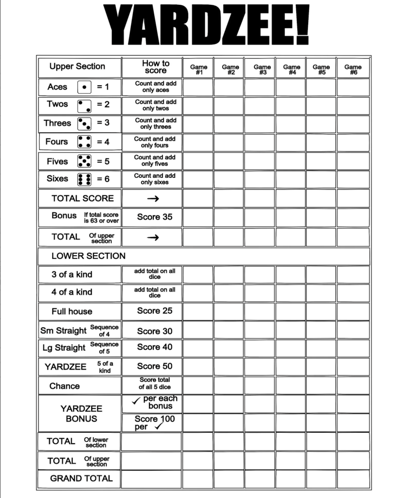

# Yatzy Refactoring Kata
My proposition for Yatzy Kata.

You can find the initial project (before refactoring) in [Emily Bache repo](https://github.com/emilybache/Yatzy-Refactoring-Kata)

## Kata Description
The problem that this code is designed to solve is explained here: [Yatzy](https://sammancoaching.org/kata_descriptions/yatzy.html)

## An example of Yatzy score sheet 

